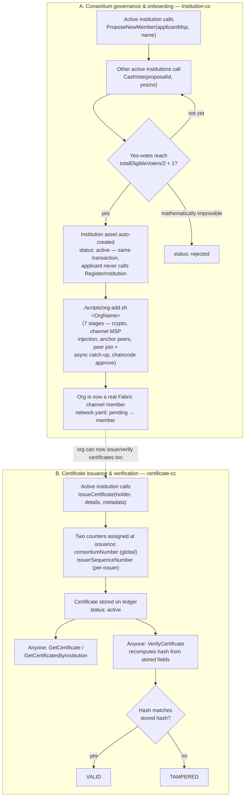

# BLC-31 — Demo Prep 

Working document for the internal catch-up call, not part of the historical
build record — see `BUILD_LOG.md`/`ERROR_LOG.md` for that. Everything below
was re-verified against the current source on 2026-07-14 (function names,
ports, script stages), not recalled from memory.

---

## 1. Architecture - (Fabric side )

```
                        ┌─────────────────────────────┐
                        │   BLCOrderer — Raft, x3      │
                        │  orderer0 / orderer1 / orderer2 │
                        └───────────────┬───────────────┘
                                        │  channel: blcchannel
        ┌───────────────────────────────┼───────────────────────────────┐
        │                               │                               │
┌───────▼────────┐             ┌────────▼────────┐             ┌────────▼────────┐
│   BLCFounder    │             │  InstitutionA   │             │  InstitutionB   │
│   (founding)    │             │   (founding)    │             │ pending → member │
│ peer0 / peer1   │             │ peer0 / peer1   │             │ peer0 / peer1   │
│ + CouchDB x2    │             │ + CouchDB x2    │             │ + CouchDB x2    │
└────────┬────────┘             └────────┬────────┘             └────────┬────────┘
         │                               │                               │
         └───────────────┬───────────────┴───────────────┬───────────────┘
                         │                               │
                ┌────────▼────────┐             ┌────────▼─────────┐
                │  institution-cc  │             │  certificate-cc   │
                │  (governance:     │             │  (issuance +      │
                │  register/propose/│            │   verification)   │
                │  vote)            │             │                   │
                │  ccaas, one       │             │  ccaas, one       │
                │  container/org    │            │  container/org     │
                └───────────────────┘             └────────────────────┘
```

Talking points:
- Production-grade topology, not MVP-scale: 3 orderers (Raft, tolerates 1
  node failure), 2 peers per org (one can restart without taking the org
  offline).
- Two chaincodes, cleanly separated by responsibility: `institution-cc` owns
  consortium membership/governance; `certificate-cc` owns certificate
  issuance/verification and calls into `institution-cc` (`InvokeChaincode`)
  only to check "is this caller an active institution."
- Chaincode runs as chaincode-as-a-service (ccaas), one container per org per
  chaincode — a deliberate deviation from Fabric's default "peer builds a
  Docker image itself" mode, forced by a real Docker Engine incompatibility
  found in Phase 7 (see `BUILD_LOG.md`).
- Everything is config-driven from `network/config/network.yaml` +
  `network/deployment/local.yaml` through the `blcgen` Go generator — no
  hand-maintained `docker-compose.yaml`/`configtx.yaml`.

---

## 2. End-to-end working flow



**A. Consortium governance (onboarding a new institution)**
1. An existing active institution calls `institution-cc`'s
   `ProposeNewMember(applicantMspId, applicantName)`.
2. Every other active institution calls `CastVote(proposalId, "yes"|"no")`.
3. Once yes-votes reach the threshold (`totalEligibleVoters/2 + 1`), the
   applicant's `Institution` asset is created automatically, in the *same*
   transaction that closes the vote — the applicant never calls
   `RegisterInstitution` itself. (A vote can also resolve to `rejected`
   early, the instant approval becomes mathematically impossible — this is
   a real, tested edge case worth mentioning if Szymon asks about stuck
   votes.)
4. That vote only creates ledger state — the applicant is not yet a real
   Fabric channel member. `./scripts/org-add.sh <OrgName>` is the separate,
   later step that actually brings it onto the network (this is the
   headline live-demo piece — see §3.3).

**B. Certificate issuance & verification**
1. Any *active* institution calls `certificate-cc`'s `IssueCertificate`.
   Issuance is deliberately unilateral at the business-logic level (per
   Szymon's own confirmation logged in `BUILD_LOG.md` Phase 8) — the
   "two institutions agree this is legitimate" property comes from the
   channel's endorsement policy (multiple orgs must independently endorse
   the transaction for it to commit), not from anything the chaincode
   itself checks.
2. Every certificate gets two independent counters, both assigned at
   issuance and stored permanently: `consortiumNumber` (global, across all
   institutions) and `issuerSequenceNumber` (per-issuer only).
3. Anyone can call `GetCertificate`/`GetCertificatesByInstitution` (lookup)
   or `VerifyCertificate` (recomputes the stored hash from the certificate's
   own fields and returns `VALID` or `TAMPERED`) — no access restriction, by
   design.

---

## 3. Live demo script (terminal-based)

Recommendation: run this from the terminal, not a UI — there is no
NestJS/API layer yet (still an empty placeholder), so the peer CLI against
the real running network **is** the honest, accurate way to show this
working end to end. A slide/diagram for §1 first, then straight into the
terminal for the rest, keeps the story concrete instead of abstract.

**Rehearse this once before the call** — some of it (esp. §3.3) takes real
time (the new org's peer catching up to the channel), and you want to
narrate while it runs rather than sit in silence.

### 3.0 One-time setup for this terminal session

```bash
cd /home/neethu/Desktop/ESPEO/Projects/BLC-Consortium-V1/network
export CRYPTO_DIR="$(pwd)/crypto"
export PEERCFG_DIR="$(pwd)/peercfg"
export ORDERER_TLS_CA="${CRYPTO_DIR}/organizations/BLCOrderer/orderers/orderer0/tls/ca.pem"
export ORDERER_ADDR="localhost:7050"
export CHANNEL_NAME="blcchannel"

# as <org> <msp> <peer0-port> <peer command...> — runs one peer CLI call
# signed as that org's Admin identity. Mirrors org-add.sh's own env-var
# pattern exactly, just wrapped for fast reuse during the call.
as() {
  local org="$1" msp="$2" port="$3"; shift 3
  FABRIC_CFG_PATH="$PEERCFG_DIR" \
  CORE_PEER_LOCALMSPID="$msp" \
  CORE_PEER_MSPCONFIGPATH="${CRYPTO_DIR}/organizations/${org}/users/Admin/msp" \
  CORE_PEER_ADDRESS="localhost:${port}" \
  CORE_PEER_TLS_ENABLED=true \
  CORE_PEER_TLS_ROOTCERT_FILE="${CRYPTO_DIR}/organizations/${org}/peers/peer0/tls/ca.pem" \
    "$@"
}

# peer0 ports (fixed, from deployment/local.yaml):
#   BLCFounder=7051   InstitutionA=9051   InstitutionB=11051
```

### 3.1 Show the network is up and who's a member today

```bash
./scripts/network.sh status

as BLCFounder BLCFounderMSP 7051 \
  peer chaincode query -C "$CHANNEL_NAME" -n institution-cc \
  -c '{"function":"GetAllInstitutions","Args":[]}'
```
Expect: `BLCFounder` and `InstitutionA` both `active`; `InstitutionB` not
listed (it's not proposed/active yet — currently `pending` in
`network.yaml`, not yet a channel member at all).

### 3.2 Governance: propose and approve InstitutionB

```bash
# InstitutionA proposes InstitutionB
as InstitutionA InstitutionAMSP 9051 \
  peer chaincode invoke -o "$ORDERER_ADDR" --tls --cafile "$ORDERER_TLS_CA" \
  -C "$CHANNEL_NAME" -n institution-cc \
  --peerAddresses localhost:7051 --tlsRootCertFiles "${CRYPTO_DIR}/organizations/BLCFounder/peers/peer0/tls/ca.pem" \
  --peerAddresses localhost:9051 --tlsRootCertFiles "${CRYPTO_DIR}/organizations/InstitutionA/peers/peer0/tls/ca.pem" \
  -c '{"function":"ProposeNewMember","Args":["InstitutionBMSP","Institution B"]}'

# note the proposalId from the invoke response (it's the transaction ID),
# then have both founding orgs vote yes — 2/2 reaches the majority
# threshold and InstitutionB is approved (and its Institution asset
# created) immediately:
PROPOSAL_ID="<paste the txid here>"

# PRE-STAGED for 2026-07-15's call: the network is already reset to this
# exact baseline (2 founders active, institution-cc + certificate-cc
# deployed, InstitutionB NOT yet a channel member). ProposeNewMember was
# already run live this morning to confirm the reset baseline is correct —
# the real, currently-open proposal is:
#   PROPOSAL_ID="d664e8529473ceb4b088196776574cf7c5d7ebf7c1b711ffa8863d8f2c955489"
# On the call, skip straight to GetProposal (to show status: open,
# votesFor: 0) and then the two CastVote calls below — no need to run
# ProposeNewMember again.

as BLCFounder BLCFounderMSP 7051 \
  peer chaincode invoke -o "$ORDERER_ADDR" --tls --cafile "$ORDERER_TLS_CA" \
  -C "$CHANNEL_NAME" -n institution-cc \
  --peerAddresses localhost:7051 --tlsRootCertFiles "${CRYPTO_DIR}/organizations/BLCFounder/peers/peer0/tls/ca.pem" \
  --peerAddresses localhost:9051 --tlsRootCertFiles "${CRYPTO_DIR}/organizations/InstitutionA/peers/peer0/tls/ca.pem" \
  -c "{\"function\":\"CastVote\",\"Args\":[\"${PROPOSAL_ID}\",\"yes\"]}"

as InstitutionA InstitutionAMSP 9051 \
  peer chaincode invoke -o "$ORDERER_ADDR" --tls --cafile "$ORDERER_TLS_CA" \
  -C "$CHANNEL_NAME" -n institution-cc \
  --peerAddresses localhost:7051 --tlsRootCertFiles "${CRYPTO_DIR}/organizations/BLCFounder/peers/peer0/tls/ca.pem" \
  --peerAddresses localhost:9051 --tlsRootCertFiles "${CRYPTO_DIR}/organizations/InstitutionA/peers/peer0/tls/ca.pem" \
  -c "{\"function\":\"CastVote\",\"Args\":[\"${PROPOSAL_ID}\",\"yes\"]}"
```

### 3.3 The headline piece — onboard InstitutionB live

```bash
./scripts/org-add.sh InstitutionB
```
Narrate each stage as it logs (they print `stage N/7: ...`): crypto +
container startup, channel config-update signed by the two existing orgs,
anchor-peer update signed by InstitutionB's own admin, peer join +
async MSP-catch-up wait (`wait_for_peer_msp_sync` — call out that this is
a real race condition this build found and fixed, not a hypothetical one),
install+approve both chaincodes, and finally the `network.yaml` status flip.
This is genuinely a fresh org joining a live, already-running consortium —
worth being explicit that this is the real mechanism, not a scripted
illusion.

```bash
grep -A1 "name: InstitutionB" config/network.yaml   # status: member now
```

### 3.4 Certificate issuance and verification

The `metadata` arg must be a JSON-encoded **string** (`"{}"`), not a bare
`{}` — the peer CLI's own `-c` JSON parser requires every `Args` element to
be a string; a raw object there fails with `json: cannot unmarshal object
into Go struct field .Args of type string` before it ever reaches the
chaincode. Confirmed live during the 2026-07-14 dry run.

```bash
as BLCFounder BLCFounderMSP 7051 \
  peer chaincode invoke -o "$ORDERER_ADDR" --tls --cafile "$ORDERER_TLS_CA" \
  -C "$CHANNEL_NAME" -n certificate-cc \
  --peerAddresses localhost:7051 --tlsRootCertFiles "${CRYPTO_DIR}/organizations/BLCFounder/peers/peer0/tls/ca.pem" \
  --peerAddresses localhost:9051 --tlsRootCertFiles "${CRYPTO_DIR}/organizations/InstitutionA/peers/peer0/tls/ca.pem" \
  -c '{"function":"IssueCertificate","Args":["Jane Doe","MSc Computer Science","{}"]}'

# grab the certificateId (txid) from the response:
CERT_ID="<paste it here>"

as InstitutionA InstitutionAMSP 9051 \
  peer chaincode query -C "$CHANNEL_NAME" -n certificate-cc \
  -c "{\"function\":\"GetCertificate\",\"Args\":[\"${CERT_ID}\"]}"

as InstitutionA InstitutionAMSP 9051 \
  peer chaincode query -C "$CHANNEL_NAME" -n certificate-cc \
  -c "{\"function\":\"VerifyCertificate\",\"Args\":[\"${CERT_ID}\"]}"
# expect: {"status":"VALID", "certificate": {...}}
```

Also issue one from `InstitutionB` right after, to show its
`issuerSequenceNumber` starting fresh at `1` while `consortiumNumber`
keeps incrementing globally — a good concrete illustration of the two
counters being genuinely independent. Confirmed live 2026-07-14:
`consortiumNumber: 2`, `issuerSequenceNumber: 1`.

```bash
as InstitutionB InstitutionBMSP 11051 \
  peer chaincode invoke -o "$ORDERER_ADDR" --tls --cafile "$ORDERER_TLS_CA" \
  -C "$CHANNEL_NAME" -n certificate-cc \
  --peerAddresses localhost:7051 --tlsRootCertFiles "${CRYPTO_DIR}/organizations/BLCFounder/peers/peer0/tls/ca.pem" \
  --peerAddresses localhost:9051 --tlsRootCertFiles "${CRYPTO_DIR}/organizations/InstitutionA/peers/peer0/tls/ca.pem" \
  -c '{"function":"IssueCertificate","Args":["John Smith","BSc Data Science","{}"]}'
```

Then the remaining query functions — per-institution lookup (filters, not a
full dump) and a single-institution governance lookup:

```bash
as InstitutionA InstitutionAMSP 9051 \
  peer chaincode query -C "$CHANNEL_NAME" -n certificate-cc \
  -c '{"function":"GetCertificatesByInstitution","Args":["BLCFounderMSP"]}'

as InstitutionA InstitutionAMSP 9051 \
  peer chaincode query -C "$CHANNEL_NAME" -n certificate-cc \
  -c '{"function":"GetCertificatesByInstitution","Args":["InstitutionBMSP"]}'

as InstitutionA InstitutionAMSP 9051 \
  peer chaincode query -C "$CHANNEL_NAME" -n institution-cc \
  -c '{"function":"GetInstitution","Args":["InstitutionBMSP"]}'
```

(`GetProposal` exists too — `institution-cc`'s 7th function — but needs a
live proposal ID from a fresh `ProposeNewMember` call to demo meaningfully;
skip it unless there's a natural moment to trigger one.)

---

## 4. What NOT to claim / open items to raise directly

- **`RevokeCertificate` is not implemented.** `certificate-cc`'s model has a
  `revoked` status constant declared but no function ever sets it — this is
  Szymon's scope call, not a bug, and not yet in or out of v1.0.
- **No NestJS/API layer exists yet** — everything above is the peer CLI
  talking directly to the chaincode. If the demo prompts "how would a real
  client integrate this," the honest answer is "that's the gateway/backend
  service, not yet built — scope also pending Szymon's call."
- Don't claim certificate revocation, backend integration, or a UI as
  "coming soon" without confirming that's actually in scope first.
